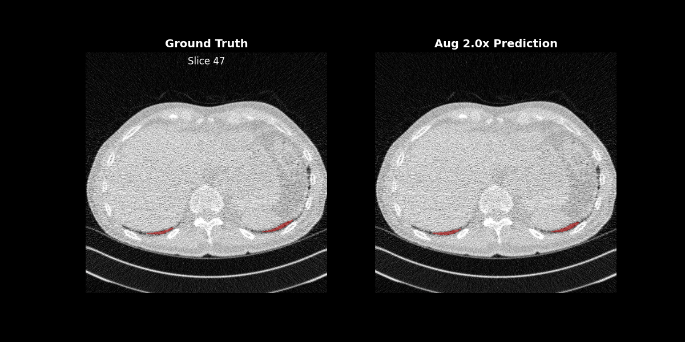

# Fibrosis-3D-nnUnet-DDPM

End-to-end research repository for **3D medical image segmentation** with **nnU-Net v2** and **diffusion-based synthetic data augmentation** workflows.

It combines:
- **Segmentation training/inference** via `nnUNet/`
- **Synthetic CT generation** via `Lung-DDPM-PLUS/`
- **Experiment orchestration scripts** for dataset creation, evaluation, and model comparison



---

## Repository Overview

This project is structured to support a full experimental loop:

1. Prepare raw data in nnU-Net format
2. Run fingerprinting, planning, and preprocessing
3. Train baseline segmentation models
4. Generate synthetic samples (DDPM)
5. Build augmented training splits
6. Retrain/evaluate and compare against baseline

The focus is reproducible experiments for fibrosis/lung CT segmentation with real + synthetic data mixtures.

---

## Architecture

### A. Segmentation Core (`nnUNet/`)
- Uses nnU-Net v2 workflows for:
  - dataset planning/preprocessing
  - training
  - inference
  - model selection/evaluation
- Supports custom trainers and pretraining/finetuning extensions.

### B. Synthetic Data Core (`Lung-DDPM-PLUS/`)
- Diffusion model training and sampling pipeline for lung/thoracic CT synthesis.
- Produces synthetic CT(+mask) assets used for augmentation experiments.

### C. Experiment Layer (root scripts)
- Python/Bash scripts coordinate:
  - data extraction and conversion
  - synthetic generation continuation/diagnostics
  - augmented dataset construction
  - cross-experiment evaluation and reporting

---

## Key Features

- **nnU-Net v2 integration** for robust 2D/3D medical segmentation pipelines
- **Diffusion-based augmentation** with configurable real/synthetic dataset ratios
- **Evaluation tooling** for baseline vs augmented model comparison
- **Pretraining/finetuning support** (including nnssl-related trainer paths in nnU-Net fork)
- **Documentation-rich workspace** for setup, planning, and operational commands

---

## Prerequisites

### Software
- Python **3.10+**
- Conda (recommended)
- PyTorch matching your CUDA/runtime
- Git + Bash

### Hardware
- GPU recommended for training (nnU-Net and DDPM)
- Fast disk for `nnUNet_preprocessed`

---

## Setup Instructions

### 1) Clone
```bash
git clone <your-repo-url>
cd Fibrosis-3D-nnUnet-DDPM
```

### 2) Create environment
```bash
conda create -n fibrosis-nnunet python=3.10 -y
conda activate fibrosis-nnunet
```

### 3) Install PyTorch
Install from: https://pytorch.org/get-started/locally/

### 4) Install nnU-Net (editable)
```bash
cd nnUNet
pip install -e .
cd ..
```

### 5) Install DDPM deps
```bash
cd Lung-DDPM-PLUS
pip install -r requirements.txt
cd ..
```

### 6) Set nnU-Net environment variables
```bash
export nnUNet_raw=/path/to/nnUNet_raw
export nnUNet_preprocessed=/path/to/nnUNet_preprocessed
export nnUNet_results=/path/to/nnUNet_results
```

### 7) Verify variables
```bash
echo "$nnUNet_raw"
echo "$nnUNet_preprocessed"
echo "$nnUNet_results"
```

---

## Common Workflow

### Baseline preprocessing
```bash
nnUNetv2_plan_and_preprocess -d DATASET_ID --verify_dataset_integrity
```

### Baseline training
```bash
nnUNetv2_train DATASET_ID 3d_fullres 0
```

### Augmented experiments
- Build augmented datasets with scripts such as `create_augmented_datasets.py`
- Train augmented datasets (`Dataset026`, `Dataset027`, `Dataset028`)
- Compare metrics with `compare_augmented_models.py`

---

## File Structure Breakdown

```text
Fibrosis-3D-nnUnet-DDPM/
├── nnUNet/                           # nnU-Net v2 framework (fork/customized)
│   ├── nnunetv2/                     # core package (train/infer/preprocess)
│   ├── documentation/                # official and custom docs
│   ├── pyproject.toml
│   └── setup.py
├── Lung-DDPM-PLUS/                   # diffusion training/sampling code
│   ├── train.py
│   ├── sample.py
│   └── README.md
├── data_preprocessing/               # conversion + slice/manifest utilities
│   ├── convert_ild_to_nnunet.py
│   ├── extract_2d_slices.py
│   └── generate_manifest.py
├── nnUNet_raw/                       # raw nnU-Net datasets
├── nnUNet_preprocessed/              # cached preprocessed datasets + plans
├── nnUNet_results/                   # checkpoints + logs
├── evaluation/                       # prediction outputs and metrics
├── create_augmented_datasets.py      # create ratio-based augmented datasets
├── compare_augmented_models.py       # compare baseline vs augmented models
├── evaluate_test_set.py              # test-set evaluation utility
├── predict_remaining_baseline.py     # fill missing baseline test predictions
└── submit_train_augmented.sh         # Slurm submission for augmented training
```

---

## Notes

- Keep data split boundaries strict to avoid leakage.
- For reproducibility, preserve seeds and metadata files.
- Prefer running long jobs through Slurm and keep log files versioned by job id.

---

## License

- `nnUNet/` includes Apache-2.0 licensing (`nnUNet/LICENSE`)
- `Lung-DDPM-PLUS/` includes MIT licensing (`Lung-DDPM-PLUS/LICENSE`)

Please verify dataset/data-use licenses separately for your deployment context.
